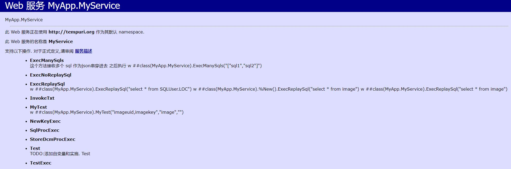

# 使用说明
## pacsServer 和 socket
> [此文件](csp_htpps_1443_pacsServer_socket/iMedPACSDB.dll) 在 **pacsServer**相关服务或 **socket** 相关服务在需要连接`cache`或`iris`库的时候使用。并且可以匿名的访问此链接 `https://{此处填写数据库ip}:1443/csp/imedpacs/MyApp.MyService.cls`  
  
-

> [此文件](csp_http_无端口_pacsServer_socket/iMedPACSDB.dll) 在 **pacsServer**相关服务或 **socket** 相关服务在需要连接`cache`或`iris`库的时候使用。并且可以匿名的访问此链接 `http://{此处填写数据库ip}/csp/imedpacs/MyApp.MyService.cls`

-

## stream
> [此文件](csp_https_1443_stream/DB.dll) 在 **stream**相关服务在需要连接`cache`或`iris`库的时候使用。并且可以匿名的访问此链接 `https://{此处填写数据库ip}:1443/csp/imedpacs/MyApp.MyService.cls`  
  
-

> [此文件](csp_http_无端口_stream/DB.dll) 在 **stream**相关服务在需要连接`cache`或`iris`库的时候使用。并且可以匿名的访问此链接 `http://{此处填写数据库ip}/csp/imedpacs/MyApp.MyService.cls`

-

## worklist 清注意 它访问的是pacs库
> [此文件](csp_https_1443_worklist/DB.dll) 在 **worklist**相关服务在需要连接`cache`或`iris`库的时候使用。并且可以匿名的访问此链接 `https://{此处填写数据库ip}:1443/csp/pacs/MyApp.MyService.cls`  
  
-

> [此文件](csp_http_worklist/DB.dll) 在 **worklist**相关服务在需要连接`cache`或`iris`库的时候使用。并且可以匿名的访问此链接 `http://{此处填写数据库ip}/csp/pacs/MyApp.MyService.cls`

备注:各个 `cahce` 或者 `iris` 在点入链接时x说看见下图:

